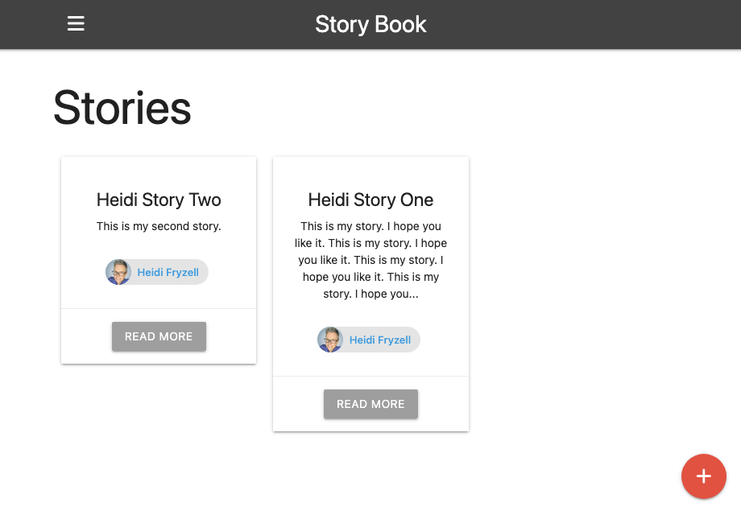

# Story Book Full Stack Application
This was a code-along with this Brad Traversy YouTube Tutorial:
[Node.js App From Scratch | Express | MongoDB | Google OAuth](https://www.youtube.com/watch?v=SBvmnHTQIPY)

The video was a couple years old so at certain points the code no longer worked when I entered it due to feature deprecation. In my code I fixed all the issues and everything is working as of the date I posted the repo to GitHub.



## How To Run The Code

1. Fork and clone this repo OR just clone to your local machine (your call)
3. Navigate into local repo and run `npm install` in your terminal
4. Install dev dependencies
```
  "devDependencies": {
    "cross-env": "^7.0.3",
    "nodemon": "^3.1.9"
  }
```
Brad used **cross-env** which allows you to set environment variables across different operating systems in a consistent way. I think the application would work without it but you'd need to update the package.json file to remove the references to it. It seems like a best practice though.
```
 "scripts": {
    "start": "cross-env NODE_ENV=production node app",
    "dev": "cross-env NODE_ENV=development nodemon app"
  },
``` 
The other dev dependency is nodemon that keeps your server running without you having to manually restart it after changes
Here is a reminder on how to install dev dependencies:
```
npm install <package-name> --save-dev
```

5. Create you own database project/cluster on MongoDB Atlas
6. Set Up Your Google Authentication, need your own API key and API secret this is covered in the [tutorial video](https://www.youtube.com/watch?v=SBvmnHTQIPY&t=2037s) 
7. Create a file called `/config/config.env` in config folder as shown. It will hold these four variables:
```
PORT =
MONGO_URI =
GOOGLE_CLIENT_ID =
GOOGLE_CLIENT_SECRET =
```
8. Start you local server from the terminal. If you are using nodemon:
```npm run dev```
9. Edit the **README.md** to add your screenshots and experiences.

## How It's Made:
### Tech Used:
          

## Optimizations

- Add photos to posts
- Add ability to like posts
- Add ability to comment on posts

## Lessons Learned

As I progressed through this tutorial a few parts of the code were no longer working, so I used ChatGPT to help me figure out the issues as they came up. I would copy the errors in the console to a ChatGPT prompt and I was able to fix all the issues. 

Other than that, the coding along went mostly very smoothly. At certain points my fonts didn't look like the tutorial and something was broken in my code. When the fonts look weird, it is often the failure to close an HTML tag. This happened to me a couple times working on the icons. I failed to close my `<i></i>` tag.

I enjoyed working with [Materialze.css](https://materializecss.com/). It helps you make a clean interface quickly.